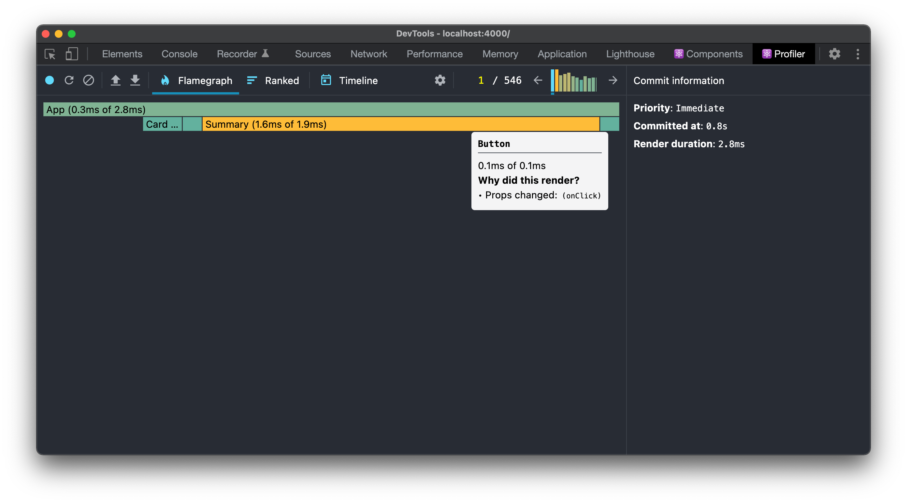
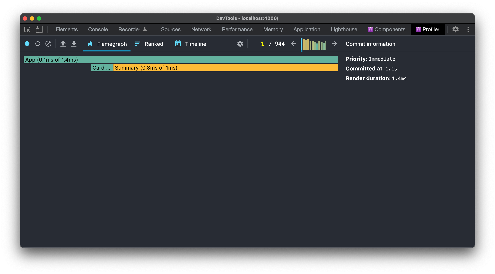

# Optimization: Class Components by preventing wasted renders

If your React class component’s **`render()`** function renders the same result given the same props and state, you can use [**`React.PureComponent`**](https://reactjs.org/docs/react-api.html#reactpurecomponent) for a performance boost in some cases.

So for the **Button** class component such as the following:

```tsx
export class Button extends React.PureComponent {
  render() {
    const { onClick } = this.props;

    return (
      <button
        onClick={onClick}
      >
        Add
      </button>
    );
  }
}
```

It should be a [**`React.PureComponent`**](https://reactjs.org/docs/react-api.html#reactpurecomponent), since this component will render the same result given the same props and state.

**HOWEVER**, declaring this button as a pure component still doesn't solve the problem of wasted rendering, if the parent component provides different instances of the callback function on every render such as the following:

```tsx
// Arrow function creates a new setIsOpen function everytime
<Button onClick={() => setIsOpen(true)} />
```

Even if provided with the same **`onClick`** value, **Button** renders every time because it receives new instances of **`onClick`** callback.

Pure components can only check for references, and in this case every render creates a new reference, hence the pure component is still re-rendering more than once. By using [**React Developer Tools**](https://chrome.google.com/webstore/detail/react-developer-tools/fmkadmapgofadopljbjfkapdkoienihi?hl=en) and [**profiling**](https://reactjs.org/docs/optimizing-performance.html#profiling-components-with-the-chrome-performance-tab) **** on Chrome, we can verify that **Button** indeed re-renders because of **`onClick`.**



To tackle this problem, the handler for **`onClick`** should only be created once. React comes with [**`useCallback`**](https://reactjs.org/docs/hooks-reference.html#usecallback) hook which creates a memoized callback, that only changes if one of the dependencies changed, similar to [**`useEffect`**](https://reactjs.org/docs/hooks-reference.html#useeffect). By utilizing this technique, we can achieve the same thing but effectively prevent the wasted rendering.

```tsx
const showDialog = useCallback(() => setIsOpen(true), []);

<Button onClick={showDialog} />
```

Again, by using [**React Developer Tools**](https://chrome.google.com/webstore/detail/react-developer-tools/fmkadmapgofadopljbjfkapdkoienihi?hl=en) and [**profiling**](https://reactjs.org/docs/optimizing-performance.html#profiling-components-with-the-chrome-performance-tab) **** on Chrome, we can verify that **Button** no longer re-renders, which means that there are no more wasted rendering.


